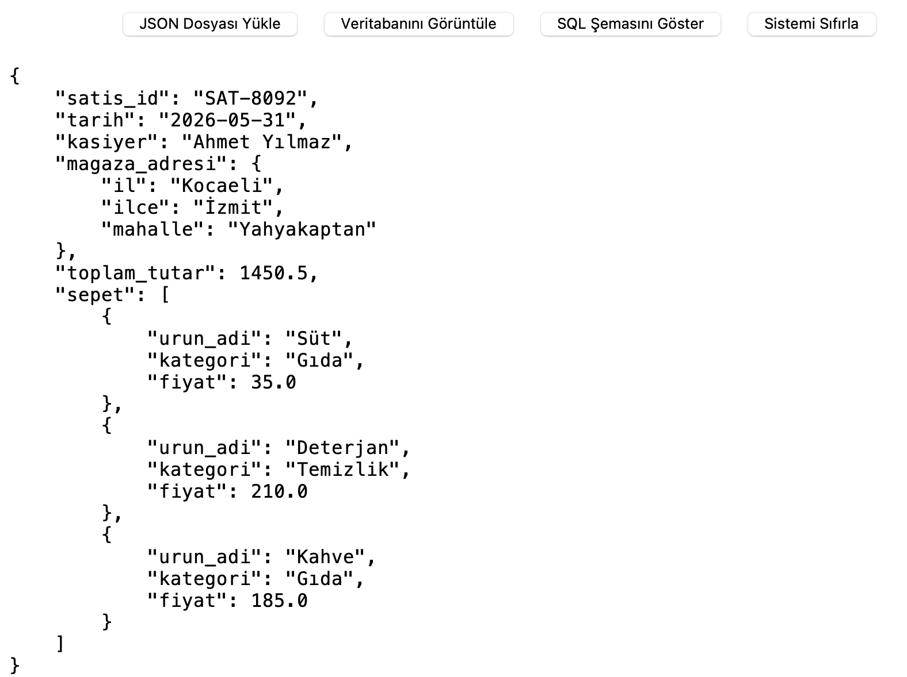
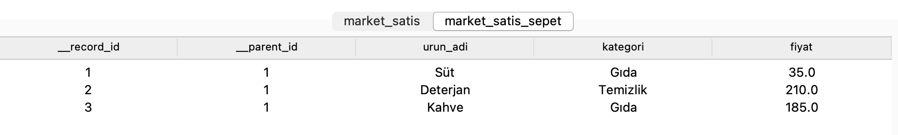
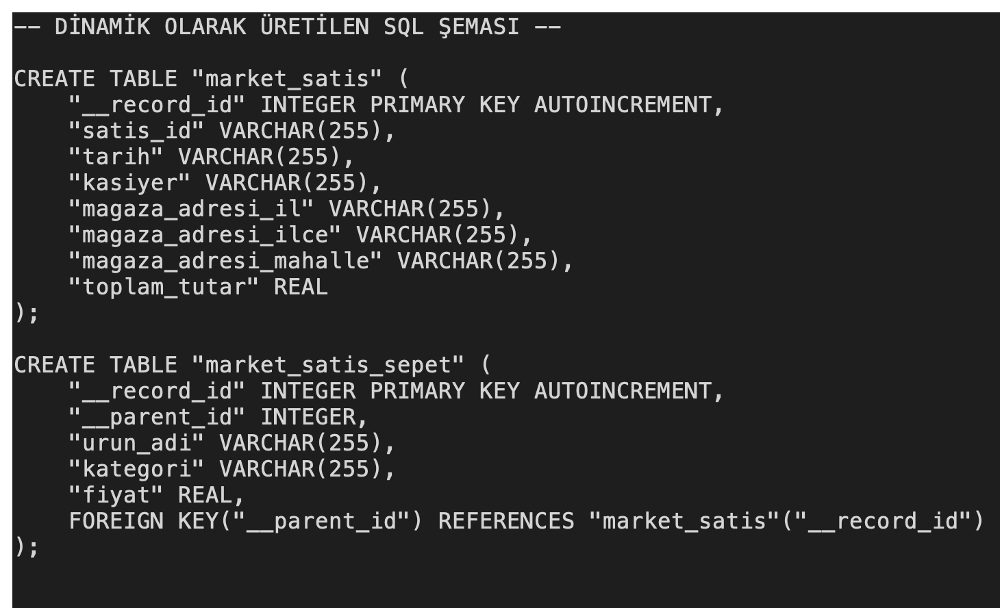

# NoSQL to SQL Converter

## Amaç
Bu proje, JSON formatındaki iç içe geçmiş NoSQL benzeri verileri analiz ederek dinamik SQL şeması oluşturur ve verileri SQLite veritabanına aktarır.

## Özellikler
- JSON dosyası yükleme
- İç içe dict yapılarını düzleştirme
- Array alanlarını ayrı alt tablolara dönüştürme
- Dinamik SQL tablo şeması üretme
- SQLite veritabanına veri aktarma
- Tkinter GUI ile veritabanı ve SQL şemasını görüntüleme

## Kullanılan Teknolojiler
- Python- Tkinter
- SQLite
- JSON parsing

## Nasıl Çalıştırılır
python -m src.main

## Örnek Kullanım
examples klasöründen bir JSON seçilir. Program otomatik olarak tablo şemasını oluşturur ve verileri SQLite’a aktarır.
## Ekran Görüntüleri

### Ana Ekran

Uygulamanın ana ekranında JSON dosyası yükleme, veritabanını görüntüleme, SQL şemasını gösterme ve sistemi sıfırlama seçenekleri bulunmaktadır.

### Veritabanı Görünümü

Yüklenen JSON verisi SQLite veritabanına aktarıldıktan sonra oluşturulan tablolar arayüz üzerinden görüntülenebilir.

### Üretilen SQL Şeması

Uygulama, iç içe JSON yapısına göre dinamik olarak SQL tablo şeması üretir. Ana tablo, alt tablolar ve ilişkiler bu ekranda incelenebilir.

## Proje Durumu
Completed / Educational Project
